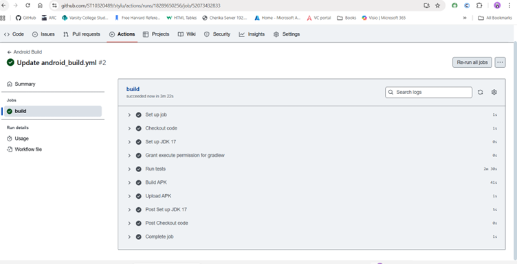
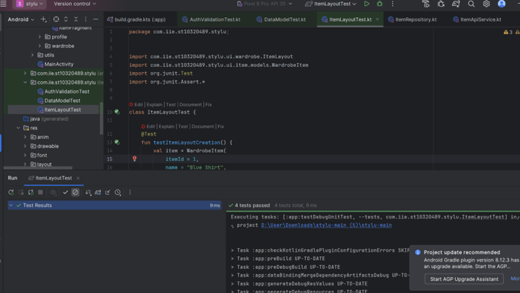
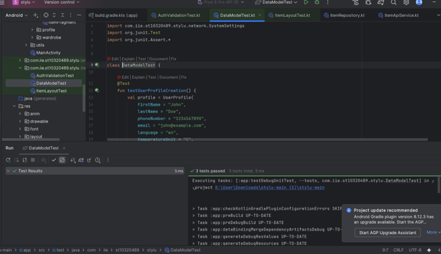
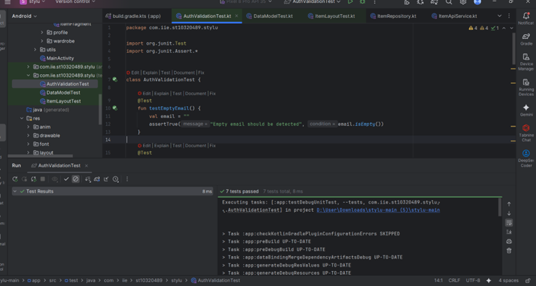

# Stylu

**Authors:** Cherika Bodde (ST10252644), Marene van der Merwe (ST10320489), Charné Janse van Rensburg (ST10089153)

Stylu is an Android application that allows users to store clothing items, create personalized outfits, and view the integrated weather to help decide what to wear.  
It combines wardrobe management with convenience and personalization, offering a stylish, user-friendly experience.

---

## Overview

Stylu helps users digitize their wardrobes by saving individual clothing items, categorizing them, and combining them into outfits.  
When users upload clothing images, the app automatically removes the background through a built-in background removal API, producing clean and consistent visuals for each item.  
Stylu also integrates real-time weather data, allowing users to plan outfits that match current conditions.

Built using Kotlin and the MVVM architecture, Stylu connects to a custom REST API for data storage, image background removal, and weather integration.

---

## How to Run the App

### 1. Launch in Android Narwhal (not Android Studio)
- Open **Android Narwhal IDE**
- Import the project
- Let Gradle sync automatically

### 2. Run the App
- Connect a device or start an emulator
- Press **Run**

---

##  Demonstration

**YouTube Demo Link:** *(Coming Soon)*

---

## API Integration

**Published API:**  
`https://stylu-api-x69c.onrender.com

**Local API code:**  
[https://github.com/ST10252644/stylu_api.git](https://github.com/ST10252644/stylu_api.git)

**Frontend Repository:**  
[https://github.com/ST10320489/stylu.git](https://github.com/ST10320489/stylu.git)

---

## Core Features

### Category Management
- **Hierarchical Organization:** Categories and subcategories  
- **Flexible Structure:** Adaptable to any fashion classification  
- **Easy Navigation:** Intuitive category browsing  

### Item Management
- **Detailed Item Records:** Comprehensive item information  
- **Image Upload:** Seamless item image handling  
- **Metadata Support:** Rich item attributes and descriptions  

### Outfit Creation
- **Mix & Match:** Combine items into stylish outfits  
- **Outfit Gallery:** Save and manage created looks  
- **Sharing Capabilities:** Share your style creations  

### Smart Features
- **Smart Categorization:** Automatic item classification based on data  

---

## Testing

Stylu includes automated tests for functionality and performance.  
See **AutomatedTest.docx** for details.

 *ItemLayoutTest*

*DataModelTest*

  
*AuthValidationTest*  

---

## Prerequisites

| Tool | Version | Purpose |
|------|----------|----------|
| Android Narwhal | Latest | Primary IDE |
| JDK | 17+ | Java Development |
| Gradle | 8+ | Build System |
| Kotlin | 1.9+ | Programming Language |

---

## Sources 

- Android Developers. (2024). *Guide to app architecture*. Google. Available at: [https://developer.android.com/jetpack/guide](https://developer.android.com/jetpack/guide)  
- JetBrains. (2024). *Kotlin Documentation*. JetBrains. Available at: [https://kotlinlang.org/docs/home.html](https://kotlinlang.org/docs/home.html)  
- Square Inc. (2023). *Retrofit: A type-safe HTTP client for Android and Java*. GitHub. Available at: [https://github.com/square/retrofit](https://github.com/square/retrofit)  
- Google. (2024). *Material Design 3*. Google. Available at: [https://m3.material.io](https://m3.material.io)  
- OpenWeather. (2024). *OpenWeather API Documentation*. Available at: [https://openweathermap.org/api](https://openweathermap.org/api)  
- Render. (2025). *Render Deployment Platform*. Available at: [https://render.com](https://render.com)  
- Remove.bg. (2024). *AI Background Removal API Documentation*. Available at: [https://www.remove.bg/api](https://www.remove.bg/api)

---

© 2025 **Cherika Bodde**, **Marene van der Merwe**, and **Charné Janse van Rensburg**.  
All rights reserved.
